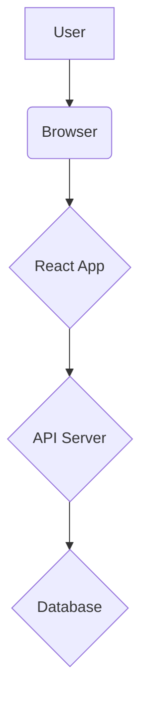

# Architecture

## Technology Stack

*   **Frontend**: React, TypeScript, Tailwind CSS
*   **Backend**: Node.js, Express.js, PostgreSQL
*   **API**: REST API

## System Architecture

## Component Descriptions

*   **User**: The user interacts with the application through a web browser.
*   **Browser**: The browser renders the React application and sends requests to the API server.
*   **React App**: The React application handles the user interface and logic of the application.
*   **API Server**: The API server handles requests from the React application, interacts with the database, and returns data to the React application.
*   **Database**: The database stores the data for the application.

## Data Flow

1.  The user interacts with the React application in their browser.
2.  The React application sends a request to the API server.
3.  The API server processes the request and interacts with the database.
4.  The database returns data to the API server.
5.  The API server returns data to the React application.
6.  The React application updates the UI to display the data to the user.

## Security

*   **Authentication**: User authentication will be handled using JSON Web Tokens (JWT).
*   **Authorization**: Authorization will be handled using role-based access control (RBAC).
*   **Input Validation**: All user input will be validated on the client and server-side to prevent security vulnerabilities such as XSS and SQL injection.
*   **Data Encryption**: All sensitive data will be encrypted in transit and at rest.